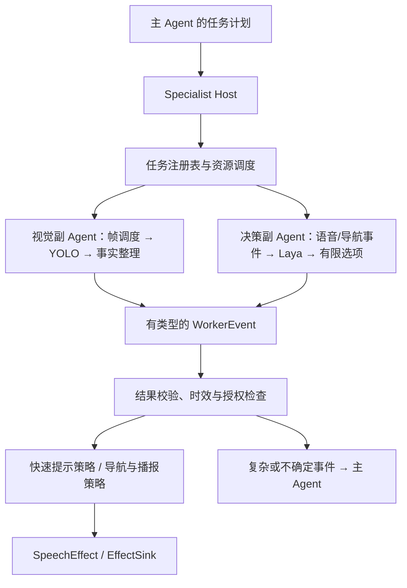

# YOLO + Laya 专长副 Agent：长期讨论规划

状态：长期讨论稿，尚未批准实施

更新日期：2026-09-29

适用项目：乐奇 AI 眼镜助盲 Agent

> 本文记录模型调研和当前架构讨论形成的候选方向。模型选择、训练数据、硬件部署、功耗预算和验收阈值仍需实测与评审。本文件不表示相关能力已经实现，也不构成持续摄像或自动避障的产品承诺。

## 1. 讨论结论

建议把 YOLO 与 Laya 封装成两种职责不同、由统一副 Agent Runtime 管理的专长执行单元：

- **YOLO 视觉副 Agent**从获得授权的图像帧中提取目标类别和当前视野方位，服务于短、快的环境提示。
- **Laya 决策副 Agent**读取语音转写、导航事件和结构化事实，处理有限范围的文字判断，例如提示简化、可选重复和是否升级给完整 Agent。
- **主 Agent**理解用户目标、配置本次专长任务、处理复杂问题，并在必要时重新接管任务。
- **Harness 与领域策略**管理授权、任务生命周期、语音优先级、必要的导航提醒和高风险领域判断。

这是一种“模型 + 任务状态 + 输入处理 + 输出治理”的副 Agent 结构。两个模型通过有类型的事件协作，不依赖自由形式的 Agent 对话。明确的视觉方向提示走快速策略路径，不等待 Laya 或完整 Agent。

## 2. 当前项目边界

当前 P0 Harness 以 `Event → Plan → Result → Effect` 为核心：一次 `SessionOrchestrator.handle()` 处理一个有序事件，`TaskRunner` 按序执行本轮计划；持续工作的副 Agent Host 尚未实现。当前文档也明确区分 Agent 的结构化计划、Provider 提供的现实事实，以及策略与授权对最终效果的控制。

产品体验目标按本次讨论记录为：尽快向用户播报“视野左侧有车”“视野右侧有台阶”等方位和类别线索，由用户自行判断。第一版不要求估计碰撞时间、计算避让路线或自动决定用户应如何移动。

导航事件只提供导航上下文，不自动授权摄像头观察。任何持续视觉观察都应由独立的用户授权或预授权模式启动，并有明确的有效期、停止条件和撤销入口。已有架构将预授权观察约束在同一 SafetyGuard 内，且要求处理冷却、媒体生命周期和撤销。

目前 P0 是设备无关核心和模拟验证；真实 Rokid/CXR、Android、地图、语音、视觉模型与 LLM 尚未端到端验证。因此，本文提出的调用时机、部署位置和性能目标均待目标设备验证。

参考项目文档：

- [Agent Harness P0 说明](../../packages/domain/agent/README.md)
- [核心 Agent 设计](core-agent-design.md)
- [模型、策略和文件交付边界](../team/file-delivery-matrix.md)（实际文件为 `docs/team/file-delivery-matrix.md`）

## 3. 模型调研摘要

### 3.1 YOLO：视觉事实提取

截至本文日期，Ultralytics 正式文档以 YOLO26 作为当前模型线。YOLO26 覆盖检测、实例/语义分割、深度、姿态和旋转框等任务；YOLO26n 是面向较小模型规模的候选。官方 COCO 基准中，YOLO26n 报告 40.9 mAP、2.4M 参数；文档列出的延迟为 T4 TensorRT 1.7ms、CPU ONNX 38.9ms。官方还提供 Android 的 NCNN 和 LiteRT 部署路线。

这些数字来自指定数据集和硬件，不能外推为 Rokid 或目标手机上的延迟、功耗或准确率。移动端推理格式存在，也不代表相机数据通路、NPU delegate 或目标系统权限已经打通。

COCO 预训练类别可作为常见人车类的初始化，但路沿、台阶、坑洞、临时障碍等目标必须核对标签覆盖，并用实际用户视角数据微调和验证。YOLO 的检测框可映射为当前图像的左/中/右区域；该输出是“视野方位”，不能未经设备姿态校准就宣称是用户身体的左右方位。

YOLOE-26 的开放词汇能力可留作用户临时指定目标的研究方向，例如按用户要求搜索某件物品。它不作为固定危险类别快速提示的默认模型；动态文本提示需要独立评估误检和延迟。YOLO26 的深度任务也不作为本计划第一版目标，因为当前短方向提示不要求距离或碰撞时间估计。

许可是框架选择的一部分：Ultralytics YOLO26 提供 AGPL-3.0 和 Enterprise 许可路径；OpenMMLab 的 MMYOLO 仓库为 GPL-3.0。若需比较较宽松许可的检测基线，可纳入 Apache-2.0 的 MMDetection/RTMDet，但它不是严格意义上的 YOLO。代码、预训练权重、数据集和导出模型均应分别核对适用条款。

资料：

- [Ultralytics YOLO26 模型资料](https://docs.ultralytics.com/models/yolo26)
- [Ultralytics 移动端部署选项](https://docs.ultralytics.com/guides/model-deployment-options)
- [Ultralytics 许可说明](https://github.com/ultralytics/ultralytics#license)
- [MMYOLO 项目与许可](https://github.com/open-mmlab/mmyolo)
- [MMDetection 项目与许可](https://github.com/open-mmlab/mmdetection)

### 3.2 Laya multilingual：文字微决策

Laya multilingual 是非自回归的结构化决策模型，面向文本或 JSON 输入提供有限选项的 `choice`、等级 `score` 和二元 `noul` 答案，不负责生成自然语言，也不能直接处理图像。模型卡列出约 322M 参数、100+ 语言和 1024 token 默认问题预算。官方仓库当前文档报告的单问题约 33ms、批量约 7.2ms/问题是在 T4 上测得，不是眼镜端或手机端数据。

作者的 typed-decision 基准报告显示，针对特定工作流微调的 checkpoint 在其 2,000 条决策、4 类工作流基准上达到 0.766 accuracy；基础英文 checkpoint 在同一基准上为 0.362。这个结果支持“领域数据和微调很重要”，但不代表助盲导航任务的预期准确率。多语言模型卡还提醒默认概率未校准，可能过度自信；应使用项目留出数据校准并允许弃答/升级。

当前候选是以中文场景微调 `laya-multilingual`，而不是直接信任零样本输出。Laya 仓库提供领域微调、温度校准和 ONNX INT8 导出相关流程；这些只说明存在技术路径，实际速度、内存、中文决策效果和功耗仍需目标手机验证。Laya 仓库与模型卡标注 Apache-2.0，具体 checkpoint 与其依赖仍需按实际分发方式核查。

资料：

- [Laya 项目与微调说明](https://github.com/NandhaKishorM/laya)
- [Laya 决策基准与已知限制](https://github.com/NandhaKishorM/laya/tree/main/research)
- [Laya multilingual 模型卡](https://huggingface.co/convaiinnovations/laya-multilingual)

## 4. 建议的角色与权威

| 组成 | 适合职责 | 输出/边界 |
|---|---|---|
| YOLO 视觉副 Agent | 从获准帧中识别人、车、自行车及经数据验证的定制障碍类；将检测框归入当前视野方位；做有限的短时稳定/去重 | 输出带类别、方位、置信信息、证据引用和时间戳的视觉事实。它不判定能否过街或替用户选择移动方向。 |
| Laya 决策副 Agent | 对导航事件、语音转写和精简后的结构化事实作有限文字决策；选择简短/完整的可选内容、识别可选重复、建议是否升级给主 Agent | 输出枚举选择或弃答，不直接生成播报文本、改写导航事实或控制设备。 |
| 主 Agent | 理解本次目标和偏好，动态组合已注册能力；回答复合问题；解决冲突、澄清与失败恢复 | 提交经过验证的任务配置；接收需解释、需规划或需用户沟通的事件。 |
| 确定性策略 | 授权、有效期、风险优先级、必需导航提醒、路口建议、语音仲裁和最终可执行效果 | 保留最终效果权威。模型的事实或决策候选不得绕过策略。 |

建议 Laya 的候选选项从有限集合开始，例如：`brief_optional`、`full_optional`、`repeat_optional`、`escalate_to_main`、`abstain`。强制导航提醒是否播报、其时效和语音优先级仍由 `NavigationReminderPolicy` 与 `SpeechPriorityPolicy` 管理。Laya 只能参与非强制细节和交互取舍；待评审后再确定具体规则。

路口内容需分层：导航 Provider 给出的转向事实可供 Laya 决定如何简化提醒；视觉副 Agent 可报告当前视野中的线索；“是否安全通行”仍属于专门授权和领域策略路径，不能由 Laya 的一个分类结果决定。

## 5. 副 Agent Runtime 候选结构



### 5.1 统一副 Agent 接口

每个副 Agent 提供能力清单（Manifest）和任务生命周期接口：

- Manifest 声明输入/输出 schema、模型与版本、支持任务、所需权限、建议延迟/资源预算和运行位置。
- Host 支持 `start`、`update`、`pause`、`resume`、`cancel`、`status`；每个任务有稳定的 `task_id`、所属 `session_id`、有效期和取消来源。
- 副 Agent 只持有完成本任务所需的短时状态，例如最近已播报目标或当前跟踪对象；任务真相、用户授权和主会话状态归 Harness 管理。
- 副 Agent 不能直接调用摄像头、地图、蓝牙、语音设备或任意 Tool。它按授权输入工作，并返回结构化事件。

统一结果至少应记录 `session_id`、`task_id`、序号、结果类型、来源模型与版本、观察时间、有效期、证据引用、状态（成功/弃答/不可用）和校准后置信信息。图像本体不进入 Laya 文本上下文；除非用户请求解释，否则传递最小化的结构化视觉事实。

### 5.2 YOLO 视觉副 Agent 内部

```text
授权/预授权帧源
  → 帧调度与图像预处理
  → YOLO 检测或分割
  → 类别映射与视野区域计算
  → 短时稳定/重复抑制
  → VisionFact / AlertCandidate 事件
```

明确的类别与视野方位可走低延迟快速提示策略，不必先询问 Laya。短时稳定处理只用于避免提示抖动或重复；不得将它描述成可靠的运动轨迹或碰撞判断。

### 5.3 Laya 决策副 Agent 内部

```text
导航事实、用户语音转写、近期交互摘要、可选视觉事实
  → 任务专属 typed-question schema
  → Laya multilingual
  → 选项校准、阈值/弃答处理
  → DecisionCandidate 事件
```

优先对少量高价值问题进行事件触发调用，例如是否简化额外导航说明、是否重复可选信息、是否需要主 Agent 处理。紧急视觉提示不等待 Laya。任何不确定、冲突、过期或超出标签空间的输入都应允许 `abstain` 并升级。

### 5.4 两个副 Agent 的协作

协作通过 Host 的事件总线完成，不让模型互相发自然语言消息：

1. YOLO 产生 `vision.fact`，Host 检查 schema、时间和任务授权。
2. 明确视觉提示由快速策略处理；需要文字取舍时，Host 才将压缩后的事实送给 Laya。
3. Laya 产生 `decision.candidate`；确定性策略检查其可选范围、校准阈值和当前语音/导航优先级。
4. 复杂问题或弃答事件回到主 Agent。主 Agent 负责解释和后续规划。

## 6. 授权、隐私与故障降级

- 默认无持续视觉观察。导航提醒只提供上下文，不构成拍摄许可。
- 视觉任务须关联用户授权来源、作用范围、开始时间、过期时间和撤销入口；撤销后停止取帧并清理短期缓存。
- 摄像头、麦克风、语音输出和本地模型分别记录所需能力；Laya 不能提升 YOLO 的授权范围。
- YOLO 不可用、检测事实过期或类别冲突时，不伪装成“未发现危险”。系统可以选择简短说明无法判断，或按任务策略静默/升级。
- Laya 不可用、超时、低置信或输出无效标签时，回退到现有确定性导航提醒和语音优先策略；不得丢失必需提醒。
- 记录模型版本、事实、候选决策、策略接受/拒绝原因和实际播报结果，以支持离线回放。回放使用记录事实，不重新调用实时模型或相机。

## 7. 训练、评估和候选路线

### YOLO 数据与微调

从公开预训练小模型微调，不从随机初始化训练。先定义用户可理解的类别词表，再采集获准的眼镜视角数据，覆盖不同头部角度、距离变化、遮挡、光照、室内外和负样本。对每个目标标注框；若目标是道路边界或可通行区域，再单独评估分割标注是否值得增加。

同一段视频的相邻帧不能同时散落在训练集和测试集，否则会高估泛化。评价应按场景、类别和视野方位拆分，并保留低照度/遮挡等困难子集。

### Laya 数据与校准

以中文 ASR 转写、导航 Provider 事实、最近已播报内容和明确任务状态构造 typed-decision 样本；标注内容取舍、可选重复、升级主 Agent 和弃答。训练/验证/测试集按真实路线或会话拆分，避免同一对话的近似样本泄漏。对每种问题类型和选项数做留出集校准。

### 分阶段接入

1. **离线回放**：建立视觉样例和导航/语音决策样例，对比 YOLO 候选、规则基线和 Laya 候选；模型只产出记录，不影响用户。
2. **影子决策**：在明确授权的试点会话中采集结果，Laya 与现有导航提醒并行记录，先比较而不改变强制提醒。
3. **有限实时提示**：启用 YOLO 对明确类别的短方位提示；保留用户开关、结束条件、播报优先级和立即取消。
4. **有限 Laya 决策**：只有在中文留出评估和策略验收后，才启用简短说明、可选重复等非强制取舍。
5. **主 Agent 升级**：为复合询问、视觉歧义、用户追问或副 Agent 弃答建立事件升级与恢复路径。

## 8. 评估指标与未决事项

### 需要在目标设备上测量的指标

- YOLO：按类别的漏报/误报、视野左右区域错误率、每小时误提示数、从取帧到播报的 P50/P95 延迟。
- Laya：各候选选项的混淆情况、强制提醒被错误压制次数（由外层策略保证为零）、弃答率、升级率和校准误差。
- 组合运行：每小时能耗、温升、模型加载与常驻内存、主 Agent 唤醒次数、音频竞争和取消响应时间。
- 用户体验：提示是否简短可辨、方向是否与当前视野一致、重复提示是否打扰。性能数字必须来自真实目标手机/眼镜链路，不以 T4 或服务器数据替代。

### 后续讨论需决定

1. YOLO 执行位置：先跑手机端，还是未来尝试眼镜/专用 NPU；相机帧从 Rokid 到手机的正式权限和传输路径尚待验证。
2. 首批危险/环境类别与“视野左/右”的播报词表，以及提示触发和短时稳定规则。
3. Ultralytics 许可、替代检测框架、预训练权重和数据集许可的最终选择。
4. 观察模式的授权形态、最长有效期、冷却时间、关闭方式和可见/可听状态提示。
5. YOLO 与 Laya 的延迟、功耗、内存和质量验收阈值；目前没有设备实测结果，暂不预填数值。
6. 哪些导航内容允许 Laya 决定简化或重复，哪些提醒始终由 `NavigationReminderPolicy` 强制产生。

## 9. 资料来源

- Ultralytics： [YOLO26 模型与任务](https://docs.ultralytics.com/models/yolo26)、[移动端部署](https://docs.ultralytics.com/guides/model-deployment-options)、[许可](https://github.com/ultralytics/ultralytics#license)
- OpenMMLab： [MMYOLO](https://github.com/open-mmlab/mmyolo)、[MMDetection](https://github.com/open-mmlab/mmdetection)
- Laya： [项目 README 与微调入口](https://github.com/NandhaKishorM/laya)、[研究基准与限制](https://github.com/NandhaKishorM/laya/tree/main/research)、[multilingual 模型卡](https://huggingface.co/convaiinnovations/laya-multilingual)
- 本项目： [Agent Harness P0 说明](../../packages/domain/agent/README.md)、[核心 Agent 设计](core-agent-design.md)、[策略与交付边界](../team/file-delivery-matrix.md)
